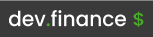
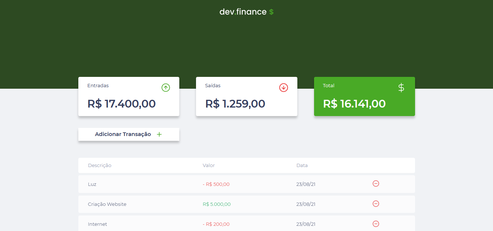

<h1 align="center">
  
</h1>




## Aplicação

Dev Finance é uma aplicação de controle financeiro onde o usuário pode adicionar ou remover receitas ou despesas do dia a dia, desenvolvida com VueJS, baseada na aplicação do Discover da Rocketseat.


## Features

 - Adicionar novas transações
 - Remover transações


 ## Tecnologias
- VueJs
- Sass

## Executando o projeto

Utilize o **yarn** ou o **npm install** para instalar as dependências do projeto.
Em seguida, inicie o projeto.

```
npm run serve
```
 

### **Projeto desenvolvido por**
[](https://www.linkedin.com/in/joilsonmslopes/)
### **Projeto original** Maratona Discover Rocketseat
[](https://www.linkedin.com/school/rocketseat/)
